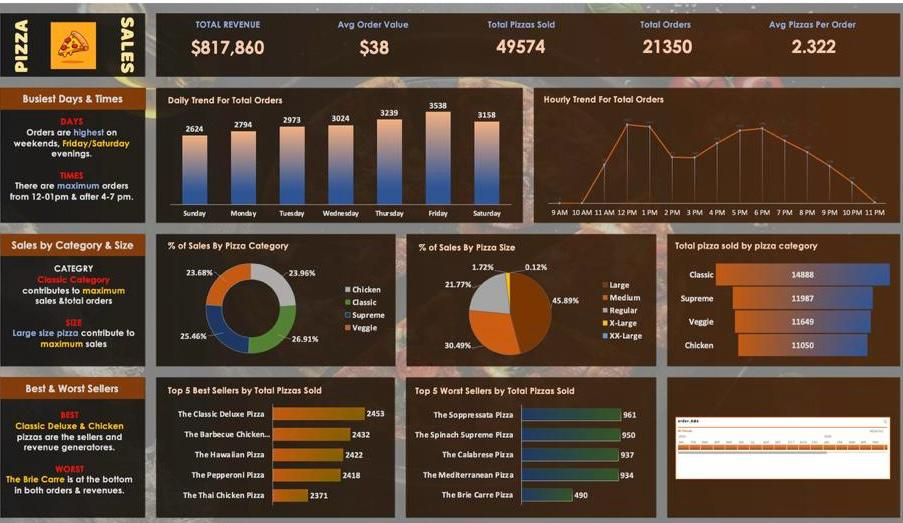

# 🍕 **Pizza Sales Dashboard**  

## 📊 **Overview**  
This repository contains an interactive **Excel dashboard** designed to visualize and analyze pizza sales data. The dashboard highlights key sales metrics, trends, and insights, making it easier for businesses to **optimize performance** and understand **customer behavior**.

---

## 🚀 **Key Features**  
1. **Total Revenue:** $817,860  
2. **Top Performer:** Classic Deluxe Pizza (2,453 sales)  
3. **Busiest Days & Times:**  
   - **Days:** Fridays & Saturdays  
   - **Peak Hours:** 12 PM–1 PM and 4 PM–7 PM  
4. **Visualizations:**  
   - **Bar charts, pie charts, and trend lines** to represent key metrics clearly.  
5. **Interactive Filters:**  
   - Use slicers and filters to explore the data dynamically.

---

## 🟠 **Dashboard Preview**  
  

---

## 👅 **How to Use**  
1. Download the `pizza_sales excel file.xlsx` from this repository.  
2. Open the file in Microsoft Excel.  
3. Navigate to the **Dashboard** tab.  
4. Use **slicers and filters** to customize the analysis.  

---

## ⚙️ **Tools & Technologies**  
- **Excel**: For data analysis, visualization, and dashboard creation.  
- **Pivot Tables**: To summarize and analyze large datasets.  
- **Charts**: Bar charts, pie charts, and line charts for visual clarity.  

---

## 🔧 **SQL Integration**  
The underlying data insights powering this dashboard were derived using **SQL queries**, which were created by **ME**. These SQL queries will be available in a separate repository: [Pizza Sales SQL Analysis](https://github.com/Pouria-Samadi/Pizza-Sales-SQL-Analysis).

---

## ⭐ **Feedback**  
If you find this project helpful or have suggestions for improvement, feel free to reach out or submit an issue!
